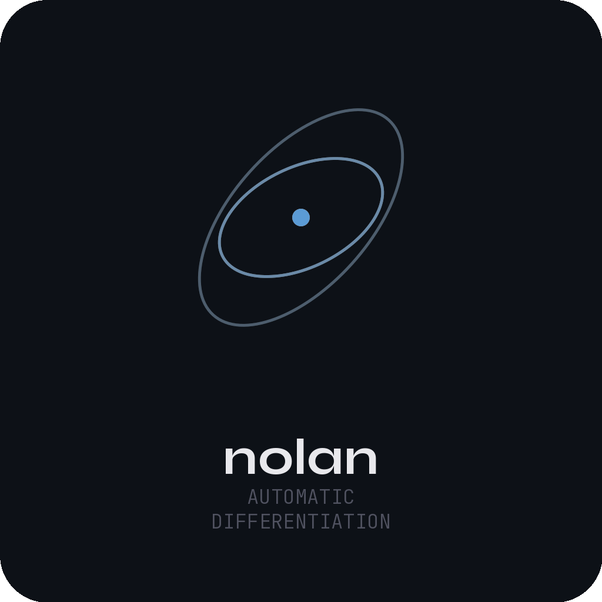

# empyrean
High-fidelity ephemeris generation, orbit propagation, and orbit determination powered by automatic differentiation

  

<a href="https://github.com/Empyrean-Dynamics/empyrean/actions/workflows/ci.yml"></a>
<a href="https://crates.io/crates/empyrean"></a>
<a href="https://docs.rs/empyrean"></a>
<a href="https://pypi.org/project/empyrean/"></a>
<a href="https://pypi.org/project/empyrean/"></a>
<a href="LICENSE-BSD"></a>
<a href="LICENSE-BINARY"></a>
<a href="Cargo.toml"></a>
<br>
<a href="https://claude.ai"></a>
<a href="https://www.empyrean-dynamics.com"></a>
<a href="https://github.com/Empyrean-Dynamics"></a>

---

empyrean is an astrodynamics toolkit for ephemeris generation,
high-fidelity propagation, and orbit determination. It ships as a
Python wheel, a C shared library, a CLI binary, and a Rust crate — a
single codebase in Rust with minimal dependencies: a custom automatic
differentiation library, a state-of-the-art orbit propagator, and an
orbit determination code leveraging the best of both.

The design premise is simple: every function and routine in the
propagator is differentiable. Force model terms, coordinate
transformations, ephemeris generation, and integrator steps each carry
exact derivatives through the computation. With those derivatives in
hand, sensitivity analyses, covariance propagation, and orbit
determination optimization come naturally rather than as an afterthought.

Linearized uncertainty propagation has its limits, even with higher-order
corrections. Close approaches, chaotic dynamics, and long arcs push it
past the point of validity. The art is in knowing when you have reached
that point and are better off switching to classical sampling methods:
Monte Carlo, line-of-variation, or Gaussian mixture sampling. empyrean
strives to do this automatically, accurately, and at the blazing speed
you would expect from a toolkit built in Rust.

The current focus is planetary science: dynamics of Solar System small
bodies like asteroids and comets, with plans to extend to cislunar space.

## Install

| Channel | Command |
|---|---|
| Python | `pip install empyrean` |
| Rust   | `cargo add empyrean` |
| CLI    | `cargo install empyrean-cli` (or grab a binary from [Releases](https://github.com/Empyrean-Dynamics/empyrean/releases)) |
| C      | download `libempyrean-<target>.tar.gz` from [Releases](https://github.com/Empyrean-Dynamics/empyrean/releases) — ships the shared library, `empyrean.h`, and LICENSE |

Current release: **0.7.0** — see the [CHANGELOG](CHANGELOG.md).

Prebuilt binaries — the engine cdylib, the CLI, and the Python wheels —
target four platforms: macOS arm64 (`macos-aarch64`), macOS x86_64
(`macos-x86_64`), Linux x86_64 (`linux-x86_64`), and Linux aarch64
(`linux-aarch64`). Python wheels are published as a single abi3
stable-ABI wheel per architecture that installs on CPython 3.10 and
every newer version (3.10–3.13), with no source distribution. `cargo add
empyrean` / `cargo install empyrean-cli` download the prebuilt engine
for those targets and stop with an error elsewhere.

All channels pull from the same published cdylib. Run `empyrean version`
(CLI), `empyrean::version_string()` (Rust), or `empyrean.version_string()`
(Python) to confirm the build provenance — every cdylib carries the
`<tag>+<sha>` strings of the `villeneuve` / `scott` / `nolan` commits
it was built against.

## Quickstart

The three headline pipelines — **propagation**, **ephemeris generation**,
and **orbit determination** (including iterative `Session` fitting) —
each shown end-to-end in Python, Rust, and CLI.

> **Defaults.** Each example uses the production hot-path: Standard
> force-model tier (Sun + planets + Moon + EIH GR + 16 SB441-N16 asteroid perturbers
> + Sun J2 + Earth J2-J4 + Marsden non-grav), GR15 integrator, `FirstOrder` (linear-
> covariance) uncertainty propagation, ICRF frame. Finite-burn thrust
> arcs (constant-RTN / velocity-tangent / inertial-fixed steering, with
> per-arc Δv targeting corrections) are available as an optional
> continuous-thrust force input on top of this model. See
> [`empyrean.propagation.config`](empyrean-py/python/empyrean/propagation/config.py)
> (Python) or [`PropagationConfig`](empyrean/src/propagate/config.rs)
> (Rust) for the full configuration surface.

### Propagate

Pull Apophis (99942) from JPL SBDB, propagate 10 years past its
SBDB epoch.

#### Python

```python
import empyrean
import numpy as np

empyrean.download_data()   # SPICE kernels, first run only
empyrean.initialize()

# 1. Pull Apophis from SBDB (Cometary orbits with covariance + non-grav).
orbits = empyrean.query_sbdb(["99942"])

# 2. Propagate 10 years past the SBDB epoch.
t0 = orbits.coordinates.epoch.to_numpy()[0]
epochs = np.array([t0 + 10.0 * 365.25])
result = empyrean.propagate(orbits, epochs)

print(f"{len(result.states)} states, {len(result.events)} events")
```

#### Rust

```rust,no_run
use empyrean::{Context, Epoch, PropagationConfig};

// Load the runtime data bundle (SPICE kernels + GM table + observatory codes).
let ctx = Context::from_data_dir(None)?;

// 1. Pull Apophis from SBDB.
let batch = empyrean::query_sbdb(&["99942"], None)?;

// 2. Propagate 10 years past the SBDB epoch.
let t0 = batch.orbits[0].state.epoch.mjd_tdb()?;
let epochs = vec![Epoch::from_mjd_tdb(t0 + 10.0 * 365.25)];
let result = ctx.propagate(&batch.orbits, &epochs, &PropagationConfig::default())?;

println!("{} states, {} events", result.states.len(), result.events.len());
# Ok::<(), empyrean::Error>(())
```

#### CLI

```sh
# One-time: download SPICE kernels into the platform data directory
# (~/.local/share/empyrean/data/ on Linux, ~/Library/Application Support/empyrean/data/
# on macOS; honors EMPYREAN_DATA_DIR).
empyrean init

# Propagate Apophis 10 years past its SBDB epoch (epoch ≈ 61269 → 64922 MJD TDB).
empyrean propagate --object-id 99942 --epoch 64922.0 --out-dir ./out

# Inspect the result Parquet — states + events tables, both with the
# same orbit_id / object_id keys you can join in pandas / Polars / DuckDB.
ls out/    # states.parquet  events.parquet
```

### Ephemeris

Predict Apophis's on-sky position (RA / Dec / range / light-time) at
Mauna Kea (MPC observatory code 568) for the next three months.

#### Python

```python
import empyrean
import numpy as np

empyrean.initialize()

orbits = empyrean.query_sbdb(["99942"])

# Sample at SBDB epoch + {0, 30, 60} days.
t0 = orbits.coordinates.epoch.to_numpy()[0]
times = np.array([t0, t0 + 30.0, t0 + 60.0])

observers = empyrean.get_observer_states(["568"], times)
result = empyrean.generate_ephemeris(orbits, observers)

# Ephemeris is a quivr table — RA, Dec (deg), range (AU), light-time (days),
# orbit_id / object_id / obs_code keys for joining.
print(result.ephemeris.to_dataframe())
```

#### Rust

```rust,no_run
use empyrean::{Context, Epoch, EphemerisConfig};

let ctx = Context::from_data_dir(None)?;
let batch = empyrean::query_sbdb(&["99942"], None)?;
let t0 = batch.orbits[0].state.epoch.mjd_tdb()?;
let epochs = vec![
    Epoch::from_mjd_tdb(t0),
    Epoch::from_mjd_tdb(t0 + 30.0),
    Epoch::from_mjd_tdb(t0 + 60.0),
];

// Observer states at Mauna Kea (MPC code 568) for each epoch.
let observers = ctx.get_observers(&["568"], &epochs)?;
let result = ctx.generate_ephemeris(
    &batch.orbits,
    &observers,
    &EphemerisConfig::default(),
)?;

for entry in &result.entries {
    println!(
        "{} @ {:.3}: RA={:.5} Dec={:.5} ρ={:.4} AU",
        entry.orbit_id, entry.epoch.mjd_tdb()?,
        entry.ra_deg, entry.dec_deg, entry.rho_au,
    );
}
# Ok::<(), empyrean::Error>(())
```

#### CLI

```sh
empyrean ephemeris --object-id 99942 --observers 568 --epoch 64922.0 --out-dir ./out
ls out/    # ephemeris.parquet
```

### Orbit determination (with `Session`)

Fit Apophis's orbit from its full MPC astrometric arc; iterate with
`Session` to mask a noisy night and compare χ² / DOF before vs after.
The CLI exposes the one-shot pipeline; the `Session` workflow is
Python / Rust only.

#### Python

```python
import empyrean

empyrean.initialize()

# 1. One-shot: read ADES PSV, run Gauss + Herget IOD + N-body DC + rejection.
obs, _radar = empyrean.read_ades("apophis.psv")
result = empyrean.determine(obs)
print(
    f"χ²/dof = {result.summary.reduced_chi2:.3f}, "
    f"RMS = {result.summary.rms_combined_arcsec:.3f}\""
)

# 2. Iterative: mask a noisy night, re-fit, diff χ² against the initial run.
sess = empyrean.Session.from_observations(obs)
sess.refine()                                  # initial fit → history[0]

bad_indices = [i for i, code in enumerate(obs.stn.to_pylist()) if code == "T05"]
for i in bad_indices:
    sess.mask(i)
sess.refine()                                  # refit without T05

diff = sess.diff(0)                            # current fit vs initial (history[0])
print(f"Δχ²/dof = {diff.reduced_chi2_delta:+.3f}, Δn_obs = {diff.n_observations_delta:+}")
```

#### Rust

```rust,no_run
use empyrean::{Context, ODConfig, Session};

let ctx = Context::from_data_dir(None)?;
let cfg = ODConfig::default();

// 1. One-shot.
let obs = ctx.read_ades("apophis.psv")?;
let result = ctx.determine(&obs, None, &cfg)?;
println!("χ²/dof = {:.3}", result.summary.reduced_chi2);

// 2. Iterative: build a session over the same arc, find the noisy
//    station's rows up front, then mask and refit. `Session::new`
//    takes ownership of the observation set, so collect the indices
//    to mask before moving `obs` into the session.
let bad_indices: Vec<usize> = obs
    .iter()
    .enumerate()
    .filter(|(_, o)| o.obs_code == "T05")
    .map(|(i, _)| i)
    .collect();

let mut sess = Session::new(obs, cfg)?;
sess.refine(&ctx)?; // initial fit → history[0]

for i in bad_indices {
    sess.mask(i)?;
}
sess.refine(&ctx)?; // refit without T05

let diff = sess.diff(0)?; // current fit vs the initial history entry
println!(
    "Δχ²/dof = {:+.3}, Δn_obs = {:+}",
    diff.reduced_chi2_delta, diff.n_observations_delta,
);
# Ok::<(), empyrean::Error>(())
```

#### CLI

```sh
empyrean determine apophis.psv --out-dir ./out
ls out/    # fitted_orbit.parquet  residuals.parquet
```

The CLI emits two sibling Parquet tables — the fitted orbit (state +
covariance + any fitted non-gravitational parameters) and the
per-observation residuals — that you can join in
pandas / Polars / DuckDB the same way you would the propagation /
ephemeris outputs.

## Validation

Every release is validated against JPL Horizons, ASSIST (reboundx),
and `find_orb` on 43 objects across 13 dynamical populations (NEOs,
MBAs, Trojans, TNOs, comets, and more). Propagated states agree with
JPL Horizons at the sub-meter level on bounded timescales, and orbit
determination results are cross-checked against `find_orb` fits and
JPL SBDB solutions. Per-release changes are tracked in the
[CHANGELOG](CHANGELOG.md).

## License

empyrean is **dual-licensed**:

- **Wrapper / binding source code in this repository** — the Rust
  wrapper crate, C-ABI bindings, Python wrapper, and CLI runner
  sources — is licensed under the
  [BSD 3-Clause License](LICENSE-BSD). You may freely use, modify,
  redistribute, and build derivative works from this source subject
  to the BSD-3 terms (attribution + disclaimer).
- **Binary distributions** — the published Python wheel, the
  pre-compiled `libempyrean` shared library, and the `empyrean`
  command-line binary — are licensed under the proprietary
  [Empyrean Binary License](LICENSE-BINARY). Binaries are free to
  install and use (including commercial use) but **may not be
  redistributed, modified, reverse-engineered, decompiled, or
  disassembled**.

### Scope of the BSD-3 source

The BSD-3 grant covers **only the binding / integration layers in
this repository** — the Rust API surface, FFI shims, Python `pyo3`
wrappers, CLI argument parsing, and build glue. The underlying
**propagation engine, orbit-determination engine, and automatic-
differentiation library are proprietary closed-source components**
distributed only as the compiled binary inside the wheel / dylib /
CLI. These engines do their work entirely inside the binary; the
BSD-3 wrapper sources call into them through stable internal APIs
but do not contain their implementations.

Practical consequence: cloning this repository and reading or
modifying the wrapper source is permitted under BSD-3, but you
cannot build a working empyrean from this source alone — the
engines are not in this repository and are not part of the BSD-3
grant. Use the published binary distribution (`pip install
empyrean`, the C dylib, the CLI binary) and treat it as the unit of
deployment.

Copyright © 2024–2026 Joachim Moeyens. All rights reserved.
