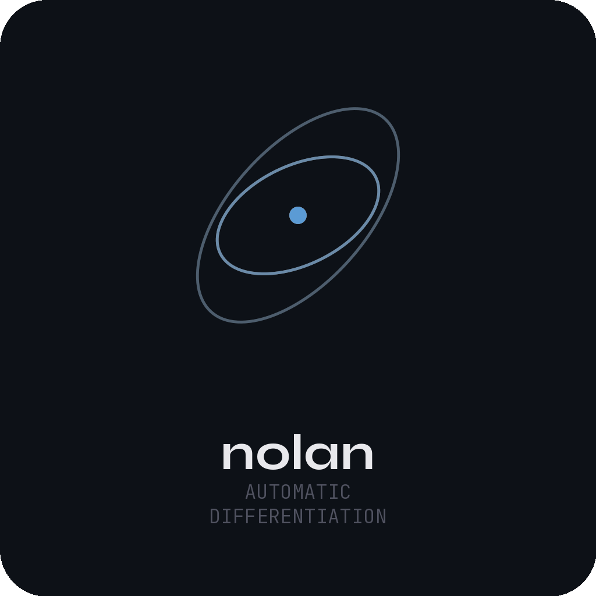

# empyrean
High-fidelity ephemeris generation, orbit propagation, and orbit determination powered by automatic differentiation

  

<a href="https://github.com/Empyrean-Dynamics/empyrean/actions/workflows/ci.yml"></a>
<a href="https://crates.io/crates/empyrean"></a>
<a href="https://docs.rs/empyrean"></a>
<a href="https://pypi.org/project/empyrean/"></a>
<a href="https://pypi.org/project/empyrean/"></a>
<br>
<a href="Cargo.toml"></a>
<a href="LICENSE-BSD"></a>
<a href="LICENSE-BINARY"></a>
<a href="https://doi.org/10.5281/zenodo.21318471"></a>
<br>
<a href="https://claude.ai"></a>
<a href="https://www.empyrean-dynamics.com"></a>
<a href="https://github.com/Empyrean-Dynamics"></a>

---

empyrean is an astrodynamics toolkit for ephemeris generation,
high-fidelity propagation, and orbit determination. It ships as a
Python wheel, a C shared library, a CLI binary, and a Rust crate — a
single codebase in Rust with minimal dependencies: a custom automatic
differentiation library, a state-of-the-art orbit propagator, and an
orbit determination code leveraging the best of both.

The design premise is simple: every function and routine in the
propagator is differentiable. Force model terms, coordinate
transformations, ephemeris generation, and integrator steps each carry
exact derivatives through the computation. With those derivatives in
hand, sensitivity analyses, covariance propagation, and orbit
determination optimization come naturally rather than as an afterthought.

Linearized uncertainty propagation has its limits, even with higher-order
corrections. Close approaches, chaotic dynamics, and long arcs push it
past the point of validity. The art is in knowing when you have reached
that point and are better off switching to classical sampling methods:
Monte Carlo, line-of-variation, or Gaussian mixture sampling. empyrean
strives to do this automatically, accurately, and at the blazing speed
you would expect from a toolkit built in Rust.

The current focus is planetary science: dynamics of Solar System small
bodies like asteroids and comets, with plans to extend to cislunar space.

## Install

| Channel | Command |
|---|---|
| Python | `pip install empyrean` |
| Rust   | `cargo add empyrean` |
| CLI    | `cargo install empyrean-cli` (or grab a binary from [Releases](https://github.com/Empyrean-Dynamics/empyrean/releases)) |
| C      | download `libempyrean-<target>.tar.gz` from [Releases](https://github.com/Empyrean-Dynamics/empyrean/releases) — ships the shared library, `empyrean.h`, and LICENSE |

Current release: **0.10.0-rc.2** (release candidate) — see the [CHANGELOG](CHANGELOG.md).

Prebuilt binaries — the engine cdylib, the CLI, and the Python wheels —
target four platforms: macOS arm64 (`macos-aarch64`), macOS x86_64
(`macos-x86_64`), Linux x86_64 (`linux-x86_64`), and Linux aarch64
(`linux-aarch64`). Python wheels are published as a single abi3
stable-ABI wheel per architecture that installs on CPython 3.10 and
every newer version (3.10–3.13), with no source distribution. `cargo add
empyrean` / `cargo install empyrean-cli` download the prebuilt engine
for those targets and stop with an error elsewhere.

All channels pull from the same published cdylib. Run `empyrean version`
(CLI), `empyrean::version_string()` (Rust), or `empyrean.version_string()`
(Python) to confirm the build provenance — every cdylib carries the
`<tag>+<sha>` strings of the `villeneuve` / `scott` / `nolan` commits
it was built against. For per-run reproducibility, a built system
handle's `describe()` additionally reports the force-model menu and the
SHA-256 identity of every kernel that run loaded.

## Channels

Four bindings, one engine binary. The same call makes the same numbers
wherever you make it; what differs is reach.

| | Python | Rust | C | CLI |
|---|:--:|:--:|:--:|:--:|
| Propagation, ephemeris generation, orbit determination | ● | ● | ● | ● |
| Multi-object `determine` keyed by ADES designation | ● | ● | ● | ● |
| Iterative `Session` refit — mask / refine / diff | ● | ● | ● | — |
| Impact probability + B-plane geometry | ● | ● | ● | — |
| Reusable built-system handle + `describe()` provenance | ● | ● | ● | — |
| Query APIs — SBDB / Horizons / MPC astrometry + radar | ● | ● | ● | — |
| SBDB orbit input by id + Horizons state vectors | ● | ● | ● | ● |
| Strict-offline context construction | ● | ● | ● | ● |
| Ephemeris overlap policy — SB441-N16 self-perturbers | ● | ● | ● | — |
| Observation planning — optical + radar candidates | ● | ● | ● | — |
| `empyrean show` output browser | — | — | — | ● |

## Quickstart

The three headline pipelines — **propagation**, **ephemeris generation**,
and **orbit determination** (including iterative `Session` fitting) —
each shown end-to-end in Python, Rust, and CLI.

> **Defaults.** Each example uses the production hot-path: Standard
> force-model tier (Sun + planets + Moon + EIH GR + 16 SB441-N16 asteroid perturbers
> + Sun J2 + Earth J2-J4 + Marsden non-grav), GR15 integrator, `FirstOrder` (linear-
> covariance) uncertainty propagation, EclipticJ2000 frame (the
> integration frame; set the frame to ICRF for ICRF output). Finite-burn thrust
> arcs (constant-RTN / velocity-tangent / inertial-fixed steering, with
> per-arc Δv targeting corrections) are available as an optional
> continuous-thrust force input on top of this model. See
> [`empyrean.propagation.config`](empyrean-py/python/empyrean/propagation/config.py)
> (Python) or [`PropagationConfig`](empyrean/src/propagate/config.rs)
> (Rust) for the full configuration surface.

### Propagate

Pull Apophis (99942) from JPL SBDB, propagate 10 years past its
SBDB epoch.

#### Python

```python
import empyrean

empyrean.download_data()   # SPICE kernels, first run only
empyrean.initialize()

# 1. Pull Apophis from SBDB (Cometary orbits with covariance + non-grav).
orbits = empyrean.query_sbdb(["99942"])

# 2. Propagate 10 years past the SBDB epoch. Times are always Epochs, and
#    the scale is always stated — a bare MJD would not say which clock.
#    from_orbits offsets each orbit's own epoch column (MJD TDB) and
#    returns the typed grid, so no scale is restated by hand.
epochs = empyrean.Epochs.from_orbits(orbits, [10.0 * 365.25])
result = empyrean.propagate(orbits, epochs)

counts = result.events.count_by_type()
print(f"{len(result.states)} states, {sum(counts.values())} events")
```

#### Rust

```rust,no_run
use empyrean::{Context, Epoch, PropagationConfig};

// Load the runtime data bundle (SPICE kernels + GM table + observatory codes).
let ctx = Context::from_data_dir(None)?;

// 1. Pull Apophis from SBDB.
let batch = empyrean::query_sbdb(&["99942"], None)?;

// 2. Propagate 10 years past the SBDB epoch.
let t0 = batch.orbits[0].state.epoch.mjd_tdb()?;
let epochs = vec![Epoch::from_mjd_tdb(t0 + 10.0 * 365.25)];
let result = ctx.propagate(&batch.orbits, &epochs, &PropagationConfig::default())?;

println!("{} states, {} events", result.states.len(), result.events.len());
# Ok::<(), empyrean::Error>(())
```

#### CLI

```sh
# One-time: download SPICE kernels into the platform data directory
# (~/.local/share/empyrean/data/ on Linux, ~/Library/Application Support/empyrean/data/
# on macOS; honors EMPYREAN_DATA_DIR).
empyrean init

# On an air-gapped machine, --no-refresh never touches the network: it
# loads what --data-dir already holds and fails naming every absent file
# rather than downloading or quietly loading less. Accepted on every
# command; here it turns init into a pure verifier. See "Data and
# offline operation" below.
empyrean --no-refresh init

# Propagate Apophis 10 years past its SBDB epoch (epoch ≈ 61269 → 64922 MJD TDB).
empyrean propagate --object-id 99942 --epoch 64922.0 --out-dir ./out

# Inspect the result Parquet — states + events tables, both with the
# same orbit_id / object_id keys you can join in pandas / Polars / DuckDB.
ls out/    # states.parquet  events.parquet

# Or page through them without leaving the terminal.
empyrean show ./out
```

### Ephemeris

Predict Apophis's on-sky position (RA / Dec / range / light-time) at
Mauna Kea (MPC observatory code 568) for the next three months.

#### Python

```python
import empyrean

empyrean.initialize()

orbits = empyrean.query_sbdb(["99942"])

# Sample at SBDB epoch + {0, 30, 60} days.
t0 = orbits.coordinates.epoch.to_numpy()[0]
times = empyrean.Epochs.from_mjd([t0, t0 + 30.0, t0 + 60.0], scale="tdb")

observers = empyrean.get_observer_states(["568"], times)
result = empyrean.generate_ephemeris(orbits, observers)

# Ephemeris is a quivr table — RA, Dec (deg), range (AU), light-time (days),
# orbit_id / object_id / obs_code keys for joining.
print(result.ephemeris.to_dataframe())
```

#### Rust

```rust,no_run
use empyrean::{Context, EphemerisConfig, Epoch, Frame, Origin};

let ctx = Context::from_data_dir(None)?;
let batch = empyrean::query_sbdb(&["99942"], None)?;
let t0 = batch.orbits[0].state.epoch.mjd_tdb()?;
let epochs = vec![
    Epoch::from_mjd_tdb(t0),
    Epoch::from_mjd_tdb(t0 + 30.0),
    Epoch::from_mjd_tdb(t0 + 60.0),
];

// Observer states at Mauna Kea (MPC code 568) for each epoch, in the
// construction basis every ephemeris consumer requires.
let observers = ctx.get_observers(&["568"], &epochs, Frame::ICRF, Origin::SSB)?;
let result = ctx.generate_ephemeris(
    &batch.orbits,
    &observers,
    &EphemerisConfig::default(),
)?;

for entry in &result.entries {
    println!(
        "{} @ {:.3}: RA={:.5} Dec={:.5} ρ={:.4} AU",
        entry.orbit_id, entry.epoch.mjd_tdb()?,
        entry.ra_deg, entry.dec_deg, entry.rho_au,
    );
}
# Ok::<(), empyrean::Error>(())
```

#### CLI

```sh
empyrean ephemeris --object-id 99942 --observers 568 --epoch 64922.0 --out-dir ./out
ls out/    # ephemeris.parquet
```

Each ephemeris row also carries its uncertainty: the 6×6 sky-plane
covariance over (ρ, RA, Dec) and their rates (AU / degree units),
mapped from the orbit's state covariance — absent when the input orbit
carries none, never zero-filled — plus the aberrated (light-time
corrected) barycentric ICRF Cartesian state at the photon-emission
epoch, with its own 6×6 covariance. A generate call additionally
returns its non-fatal warnings — an Earth-orientation kernel coverage
gap bridged by the analytic IAU 2006 fallback, a row whose sensitivity
chain was skipped — so a silent run is a clean run.

One case needs a deliberate choice: generating an ephemeris for one of
the sixteen SB441-N16 bodies (1 Ceres, 2 Pallas, 4 Vesta, 7 Iris, …),
which at Standard tier are simultaneously the target and part of the
force model. The default `ephemeris_overlap_policy` returns the body's
own SPK states and integrates nothing, so the call fails for want of a
dense trajectory. Set the policy to `exclude_and_integrate` (or name
the body in `excluded_perturbers`) and the overlapped perturber is
dropped from the force model, your initial conditions are integrated,
and the overlap is reported. It lives on the propagation config, so
Python, Rust, and C all reach it; the CLI exposes no flag for it.

### Orbit determination (with `Session`)

Fit Apophis's orbit from its full MPC astrometric arc — optical and
radar together — then iterate with `Session` to mask a noisy night and
compare χ² / DOF before vs after. `determine` is multi-object at every
layer: hand it an ADES set covering many designations and it returns one
result per object, keyed by designation. The CLI exposes the one-shot
pipeline; the `Session` workflow is Python, Rust, and C.

#### Python

```python
import empyrean

empyrean.initialize()

# 1. One-shot: read ADES PSV, run Gauss + Herget IOD + N-body DC + rejection.
#    A file's radar block is folded into the same fit as the astrometry.
obs, radar = empyrean.read_ades("apophis.psv")
fits = empyrean.determine(obs, radar=radar)   # every object in the file
result = fits.single()                        # one object in, one fit out
print(
    f"χ²/dof = {result.summary.reduced_chi2:.3f}, "
    f"RMS = {result.summary.rms_combined_arcsec:.3f}\""
)

# 2. A many-object file indexes by ADES designation. Every input object
#    gets a .summary row whether or not it produced an orbit, and a failed
#    object carries a typed reason instead of aborting the batch.
print(f"{len(fits.delivered)} of {len(fits)} delivered")
for object_id, failure in fits.failures.items():
    print(f"  {object_id}: {failure.kind} — {failure.message}")

# 3. Iterative: mask a noisy night, re-fit, diff χ² against the initial run.
sess = empyrean.Session.from_observations(obs)
sess.refine()                                  # initial fit → history[0]

bad_indices = [i for i, code in enumerate(obs.stn.to_pylist()) if code == "T05"]
for i in bad_indices:
    sess.mask(i)
sess.refine()                                  # refit without T05

diff = sess.diff(0)                            # current fit vs initial (history[0])
print(f"Δχ²/dof = {diff.reduced_chi2_delta:+.3f}, Δn_obs = {diff.n_observations_delta:+}")
```

#### Rust

```rust,no_run
use empyrean::{Context, ODConfig, Session};

let ctx = Context::from_data_dir(None)?;
let cfg = ODConfig::default();

// 1. One-shot. `determine` fits every object the file groups into;
//    `into_single` unwraps the one-object case and refuses — naming
//    them — rather than choosing among several.
let obs = ctx.read_ades("apophis.psv")?;
let batch = ctx.determine(&obs, None, &cfg)?;
println!("{} of {} object(s) delivered", batch.delivered_count(), batch.len());
for f in batch.failures() {
    println!("  {}: {}", f.object_id, f.message);
}
let result = batch.into_single()?;
println!("χ²/dof = {:.3}", result.summary.reduced_chi2);

// 2. Iterative: build a session over the same arc, find the noisy
//    station's rows up front, then mask and refit. `Session::new`
//    takes ownership of the observation set, so collect the indices
//    to mask before moving `obs` into the session.
let bad_indices: Vec<usize> = obs
    .iter()
    .enumerate()
    .filter(|(_, o)| o.obs_code == "T05")
    .map(|(i, _)| i)
    .collect();

let mut sess = Session::new(obs, cfg)?;
sess.refine(&ctx)?; // initial fit → history[0]

for i in bad_indices {
    sess.mask(i)?;
}
sess.refine(&ctx)?; // refit without T05

let diff = sess.diff(0)?; // current fit vs the initial history entry
println!(
    "Δχ²/dof = {:+.3}, Δn_obs = {:+}",
    diff.reduced_chi2_delta, diff.n_observations_delta,
);
# Ok::<(), empyrean::Error>(())
```

#### CLI

```sh
empyrean determine apophis.psv --out-dir ./out
ls out/    # fit_summary.csv  fit_summary.parquet  fitted_orbits.parquet  residuals.parquet

# stderr carries a per-object table — converged, iterations, RA / Dec RMS,
# observations contributed and kept, and both acceptability verdicts —
# with every failure named in full underneath it. The exit code is the
# batch's verdict: 0 when every object delivered, 3 when some did,
# 4 when none did.
echo $?
```

Determination is batch-first at every layer: the ADES file is grouped by
object identifier and every object is fitted, so the CLI emits sibling
tables — the fitted orbits (state + covariance + any fitted
non-gravitational parameters, one row per delivered object, keyed by its
ADES designation), a per-object fit summary covering every *input* object
whether or not it produced an orbit, and the per-observation residuals
carrying an `object_id` column so a flat table across a batch stays
attributable. `fit_summary` is always written as both parquet and CSV,
whatever `--format` says, so a partially successful batch can be read at
a terminal without a parquet tool. Join them in pandas / Polars / DuckDB
the same way you would the propagation / ephemeris outputs.

Every table is written whole. The residual file carries the complete
36-field per-observation surface — the `obs_id` / `object_id` join keys,
observatory code, catalog and epoch, the effective residual covariances,
the entire typed rejection block (reason, criterion, threshold, effective
threshold, information loss), the influence diagnostics, the
along / cross-track decomposition, and the radar block — in parquet, CSV,
and JSON alike, all three emitted from one column table so they cannot
disagree. The fitted-orbit CSV carries the same 82-column schema as the
parquet, covariance included, rather than a lossy projection of it.

Parquet additionally carries the **wide cross-covariance** — the
state↔parameter and parameter↔parameter terms beyond the state+Marsden
9×9 — in a tagged tail, so a fitted orbit round-trips through a parquet
file with the joint the fit actually computed rather than its diagonal
blocks. It is the only orbit format here that can, and the other two
refuse such a batch by name rather than writing it short — both pointing
at parquet. CSV cannot because the schema makes the difference between
an absent cross and a supplied zero cross load-bearing, and CSV renders
both as an empty cell; the JSON orbit format is this crate's own flat
row shape, carrying the 6×6 and nothing beyond it. A carrier holding
thrust Δv terms is refused wherever it is offered, because no orbit-file
format can serialize the thrust arcs those terms describe.

Residual rows are typed by observable. Optical rows carry the RA / Dec
and along / cross-track residuals with the track-frame pair's full
2×2 covariance; radar rows carry the delay (seconds) or Doppler
(hertz) observed − predicted residual with its χ², degrees of freedom,
survival probability, and combined variance. Every row also reports
its D-optimality information loss on removal — +∞ marks an
observation the fit cannot do without.

No observation is ever dropped without saying why. Every row carries a
typed `rejection_reason` — `accepted`, `chi_squared`, `sigma_clip`,
`cooks_distance`, `adaptive`, `cmc2003`, `unsupported_observatory`,
`outside_arc`, `non_finite_chi2`, `missing_jacobian`, and the rest —
written as a name rather than an integer code, alongside the criterion
value that was tested, the threshold it was tested against, and the
effective threshold when the adaptive layer set one.

Both acceptability verdicts travel with the fit and reach the files.
`fit_acceptable` is the fit-quality gate; `extrapolation_acceptable` is
that AND four forward-propagation axes, each writing its own boolean,
measured value, and threshold: the fraction of observations retained,
the span the selected observations still cover, the gap between the last
selected and the last available observation, and σₐ / |a|. A fit that is
not safe to propagate therefore says *which* axis failed — a heavily
pruned arc, a selected span that no longer covers the requested one, a
rejected recent tail — rather than only that it is not. A quantity that
could not be computed is NaN, never `0.0`, which would read as a
measurement at the floor.

Underneath, the fit is the engine's, and three of its lanes are what
carry the hard objects. Optical and radar are solved together rather
than in sequence — radar rows are grouped by the same object identifier
and folded into that object's fit, so delay and Doppler tighten the same
covariance the astrometry does. A co-orbital IOD lane seeds the
Earth-Trojan-class geometries (2010 TK7, 2020 XL5) the classical cascade
does not reach; it fires only when every co-orbitality gate passes, and
`coorbital_enabled` on the OD config turns it off. And the
outward-expansion pipeline escalates across the dynamical discontinuities
that break a long comet arc, delivering the full arc where it can and
tagging what it could not reconcile `outside_arc` where it cannot — set
`allow_arc_truncation` to false and that fallback becomes a loud failure
instead of a partial fit. Observation weights default to the VFCC2017
station floors (Vereš, Farnocchia, Chesley & Chamberlin 2017) with
nightly de-weighting.

Beyond the six-element state, `determine` and `refine` solve a wider
parameter set — the Marsden A1/A2/A3 non-gravitational coefficients,
the (cometary outgassing) time delay DT, the solar-radiation-pressure
area-to-mass ratio (AMRAT), and thrust Δv-correction segments — each
carried through the fit with the exact derivatives the propagator
already computes. DT, AMRAT, and the thrust segments are refine-path
solves: the orbit you pass in must already carry a prior (a declared
variance) on the parameter, and that prior is what opens it to the
fit. Ask for a parameter the orbit has no prior for and the call
errors loudly — it never returns a zeroed or silently defaulted
column.

The result carries a tagged solved covariance: the identities of the
fitted parameters travel with the matrix, so you read a parameter's
variance from its slot — the DT slot, the AMRAT slot, a thrust
component — rather than guessing at column order.

It also carries an event-aware trust verdict on that covariance:
trusted; encounter-intervenes — naming the intervening close approach
or high-nonlinearity crossing, and whether a second-order state-only
correction can recover it; or weakly-determined for wider solves,
where the delivered 6×6 is the marginal of a higher-dimensional fit.
Absence of a verdict is not trust — it means no gate ran.

An optional post-OD photometry fit recovers the absolute magnitude H
and a phase-function slope from the arc's observation magnitudes. It
runs after the orbit is solved, climbing a model ladder — H-only →
HG₁₂ → HG₁G₂ (Muinonen et al. 2010) — to the richest model the arc's
phase-angle coverage supports, and reports H with an honest 1σ.
Magnitudes in bands with no adopted V-band conversion are excluded,
counted, and their band codes listed — the observations' astrometry
is unaffected.

### Reading the outputs back

Every pipeline command writes Parquet / CSV / JSON, and `empyrean show`
reads them at a terminal. It only reads files: no kernels, no engine, so
it works on a machine that has the CLI and nothing else, and on files
copied off a cluster.

```sh
# Point it at an output directory: it lists what is there — file, rows,
# size, and what each artifact holds — then asks which one to open.
empyrean show ./out

# Or name a file. It streams a page at a time, so a multi-million-row
# residual table draws its first screen immediately.
empyrean show out/residuals.parquet

# In the pager: space / b page, ←/→ slide the column window over a wide
# table, / filters rows, Esc clears the filter, q quits.
empyrean show out/fitted_orbits.parquet

# Or narrow it up front. --columns subsets and reorders, --limit caps
# rows, --full-precision prints every digit so a value round-trips to
# the same f64.
empyrean show out/fit_summary.csv \
  --columns object_id,status,reduced_chi2,extrapolation_acceptable --limit 20

# Piped, it stops paging and writes the whole table as aligned text with
# nothing truncated — so it composes.
empyrean show out/residuals.parquet | grep missing_jacobian | head
```

## Data and offline operation

`empyrean init` (CLI), `empyrean.download_data()` (Python), and
`empyrean::download_data` (Rust) provision a data directory: files
already present are kept and only the missing ones are fetched, so
re-running costs nothing. On Python, kernels supplied by installed data
packages are staged with no network access at all.

A context can then be built with the network switched off. Strict
offline resolves the tier's kernel set from the data directory alone and
fails, **naming every absent file**, if any is missing — there is no
try-the-network-and-tolerate path and no quiet degrade to a lower tier.
The absent names come back as a list rather than as prose:
`Error::missing_data_files()` in Rust, a `missing_data_files` attribute
on the `FileNotFoundError` Python raises, `empyrean_missing_data_files()`
in C. It is reachable on every channel — `initialize(refresh=False)`
(Python), `Context::from_data_dir_with` with `DataDirOptions` (Rust),
`empyrean_context_from_data_dir_with` with `EmpyreanDataDirOptions` (C),
and the global `--no-refresh` flag on every CLI command, where
`empyrean init --no-refresh` becomes a pure verifier that downloads
nothing and reports exactly what the directory lacks.

`EMPYREAN_OFFLINE=1` in the environment is a floor, not a switch: it
downgrades a requested refresh to off and announces it on stderr, and it
can only ever remove network access, never restore it. It binds **data
provisioning** on every channel that reads the environment — both Rust
constructors (`Context::from_data_dir` and `Context::from_data_dir_with`),
`initialize()` in Python, and the CLI's data-acquiring commands — and
the provisioning calls that have no offline form
(`empyrean::download_data`, `empyrean.download_data()`, `empyrean init`)
refuse under it rather than download. Only the exact value `1` asserts
it.

Two things it deliberately does **not** cover, so that a machine-level
assertion is never mistaken for more than it is. The catalog query
helpers — `query_sbdb`, `query_horizons`, `query_horizons_vectors`,
`query_observations`, `query_radar`, and the CLI's `query` command and
`--object-id` inputs — call JPL and the MPC directly and are not gated
by the variable. Neither is the C ABI, which reads no environment
variable at all by design: a C caller states the policy in the
`EmpyreanDataDirOptions` it passes.

## Validation

Every release is validated against JPL Horizons, ASSIST, `find_orb`,
GRSS, and OpenOrb on a curated catalog of 50 objects across 13
dynamical populations — NEOs, MBAs, SB441-N16 self-perturbers, Jupiter
/ Neptune / Earth Trojans, TNOs, Centaurs, comets, interstellar objects,
temporarily-captured objects, confirmed impactors, and short-arc NEOs.
The same plan runs through all four channels, so cross-channel parity is
measured rather than assumed. Propagated states agree with JPL Horizons
at the sub-meter level on bounded timescales; orbit determination
results are cross-checked against `find_orb` fits and JPL SBDB
solutions, and radar delay / Doppler residuals against GRSS. Per-release
changes are tracked in the [CHANGELOG](CHANGELOG.md).

## Citing

If you use empyrean in your research, please cite it. Citation
metadata ships in [`CITATION.cff`](CITATION.cff) (GitHub's "Cite this
repository" button renders it), and every GitHub release is archived
on Zenodo with a version-specific DOI — prefer citing the DOI of the
exact version you used. The DOI badge at the top of this page carries
the concept DOI ([10.5281/zenodo.21318471](https://doi.org/10.5281/zenodo.21318471)),
which always resolves to the latest archived release.

## License

empyrean is **dual-licensed**:

- **Wrapper / binding source code in this repository** — the Rust
  wrapper crate, C-ABI bindings, Python wrapper, and CLI runner
  sources — is licensed under the
  [BSD 3-Clause License](LICENSE-BSD). You may freely use, modify,
  redistribute, and build derivative works from this source subject
  to the BSD-3 terms (attribution + disclaimer).
- **Binary distributions** — the published Python wheel, the
  pre-compiled `libempyrean` shared library, and the `empyrean`
  command-line binary — are licensed under the proprietary
  [Empyrean Binary License](LICENSE-BINARY). Binaries are free to
  install and use (including commercial use) but **may not be
  redistributed, modified, reverse-engineered, decompiled, or
  disassembled**.

### Scope of the BSD-3 source

The BSD-3 grant covers **only the binding / integration layers in
this repository** — the Rust API surface, FFI shims, Python `pyo3`
wrappers, CLI argument parsing, and build glue. The underlying
**propagation engine, orbit-determination engine, and automatic-
differentiation library are proprietary closed-source components**
distributed only as the compiled binary inside the wheel / dylib /
CLI. These engines do their work entirely inside the binary; the
BSD-3 wrapper sources call into them through stable internal APIs
but do not contain their implementations.

Practical consequence: cloning this repository and reading or
modifying the wrapper source is permitted under BSD-3, but you
cannot build a working empyrean from this source alone — the
engines are not in this repository and are not part of the BSD-3
grant. Use the published binary distribution (`pip install
empyrean`, the C dylib, the CLI binary) and treat it as the unit of
deployment.

Copyright © 2024–2026 Joachim Moeyens. All rights reserved.
